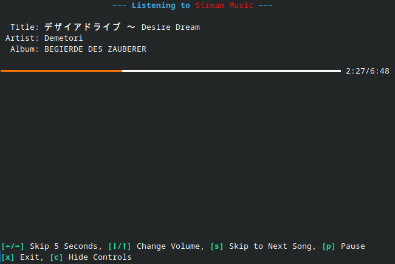
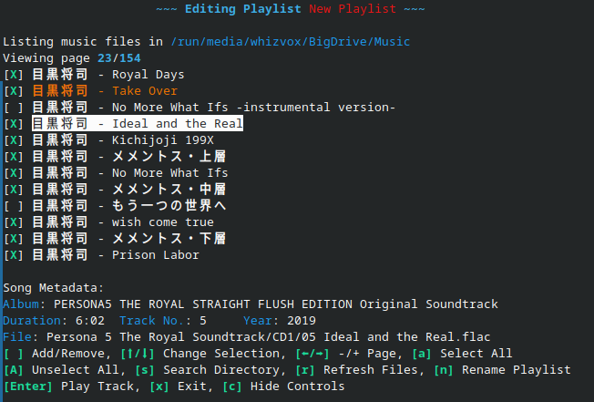

# mupl

mupl is a **mu**sic **pl**ayer. It is a terminal application written in Python, making it compatible with most operating
systems.

## How to Run

*The following is intended for developers and advanced users. If you just want a one-click, easy solution, that is not available yet.* 

1. Clone this repository.
2. Install Python 3.14.
3. Open your terminal of choice and `cd` to this directory.
4. **(Optional)** Set up a virtual environment so this won't conflict your global Python installation.
    * Run `python -m venv .venv`
    * Any commands that start with `python` or `pip` should instead start with `.venv/bin/python` or `.venv/bin/pip`.
5. Run `pip install -r requirements.txt`.
6. Run `python -m mupl.mupl`.

## Images

|  |
|:---------------------------------------------------------:|
|                     The music player                      |

|  |
|:---------------------------------------------------------------------------:|
|                             The playlist editor                             |

## License

This project is licensed by the MIT License, a copy of which is provided at `LICENSE.txt`.